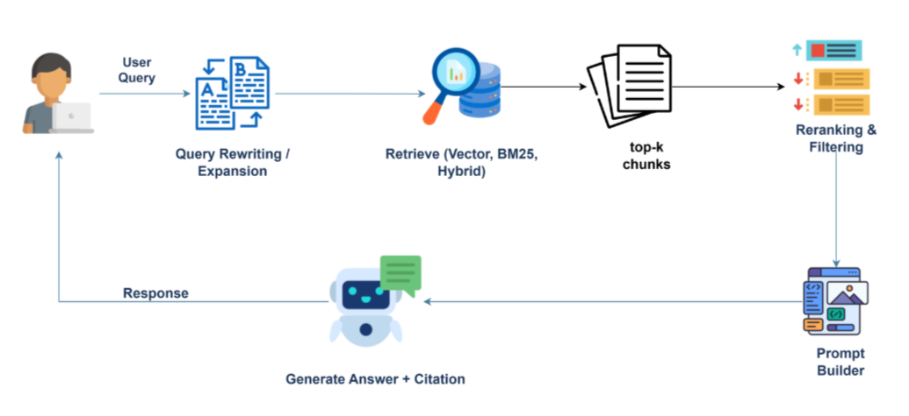

# Educational Video QA System

### Course Project – CS431: Deep Learning Techniques and Applications
### University of Information Technology – VNU-HCM (UIT)
### Lecturer: Dr. Nguyễn Vinh Tiệp

This project implements an intelligent question-answering system for educational videos using a Retrieval-Augmented Generation (RAG) pipeline. It enables users to upload video lectures, index their content, and ask natural-language questions which the system answers based on retrieved video segments. The system leverages multimodal processing to extract knowledge from both visual slides and audio lectures.

## System Pipeline



Our system architecture is divided into two main phases: an **Offline Pipeline** for knowledge extraction and an **Online Pipeline** for query processing and answer generation.

### 1. Offline Pipeline (Knowledge Extraction)
- **Visual Processing:** Detect shot boundaries using TransNet V2 and extract keyframes by evaluating semantic changes using CLIP (`ViT-L/14`). Extract text from keyframes using DeepSeek-OCR[cite: 112].
- **Audio Processing:** Extract speech-to-text transcripts from video audio using the Whisper model, retaining timestamp information[cite: 118].
- **Multimodal Fusion & Normalization:** Merge visual slide text and audio transcripts based on overlapping timestamps[cite: 120, 121]. Utilize Google Gemini to rewrite and normalize the merged text into coherent, semantically rich contexts.
- **Indexing & Storage:** Store the normalized text and index it using BM25, while also mapping it into dense vectors using semantic embedding models (e.g., `hiieu/halong_embedding`).

### 2. Online Pipeline (Retrieval & Generation)
- **Query Rewriting:** Process user queries through Gemini LLM to clarify intent and expand academic terminology before retrieval[cite: 158, 159].
- **Hybrid Retrieval:** Search the knowledge base by combining keyword-based BM25 and dense semantic embedding retrieval[cite: 175].
- **Reranking:** Refine the order of retrieved context chunks using the `BAAI/bge-reranker-base` cross-encoder model to prioritize highly relevant information.
- **Citation-Aware Generation:** Feed the top-ranked contexts to Google Gemini to generate natural, accurate answers that strictly include specific video timestamp citations.

## Team Members

| No. | Full Name         | Student ID | Responsibilities                                                                                                                                                                                                                           |
| --- | ----------------- | ---------- | ------------------------------------------------------------------------------------------------------------------------------------------------------------------------------------------------------------------------------------------ |
| 1   | Pham Nguyen Tuong | 23521751   | Project leader. Designed benchmark dataset from educational videos with 100 QA pairs and references, performed evaluation using RAGAS, and integrated LLM-based answer generation from processed multimodal features.                      |
| 2   | Chuong Hong Van   | 23521769   | Developed visual processing pipeline, implemented demo workflow, and integrated visual/audio feature extraction pipelines into unified Jupyter Notebook processing for JSON-based feature generation used by the RAG system.               |
| 3   | Tang Hoang Phuc   | 23521219   | Developed audio processing pipeline, extracted speech transcripts from educational videos, and prepared transcript-based semantic features for multimodal retrieval and question answering.                                                |

## Features

- **Multimodal Data Ingestion:** Processes both visual slide content (OCR) and lecturer audio (ASR) to build a comprehensive knowledge base[cite: 91, 120].
- **LLM-Powered Query Expansion:** Automatically rewrites user queries for improved retrieval accuracy[cite: 158].
- **Advanced Hybrid Search & Reranking:** Combines keyword search (BM25) with semantic embeddings and a dedicated reranker model for optimal context retrieval[cite: 148, 152].
- **Verifiable Answers:** Generates academic answers with direct timestamp citations, allowing users to quickly navigate to relevant video segments[cite: 198, 200].
- **Workspace Management:** Upload, organize, and manage educational videos securely with JWT authentication.

## Evaluation & Experimental Results

We evaluated our RAG pipeline comprehensively by assessing both the **Retrieval phase** and the **Generation phase** using a manually curated benchmark dataset of academic questions[cite: 220, 237].

### 1. Retrieval Performance
To evaluate the system's ability to find and rank relevant context chunks, we used Mean Reciprocal Rank (MRR) and Hit Rate metrics across various configurations[cite: 240, 241].

| Retrieval Strategy | MRR | Hit@1 | Hit@3 | Hit@5 |
| :--- | :---: | :---: | :---: | :---: |
| **BM25 (Baseline)** | 0.844 | 0.74 | 0.96 | 0.98 |
| **dangvantuan/vietnamese-embedding** | 0.581 | 0.42 | 0.68 | 0.80 |
| **hiieu/halong_embedding** | 0.958 | 0.94 | 0.96 | 0.98 |
| **BM25 + hiieu/halong_embedding** | 0.915 | 0.84 | 0.98 | 1.00 |
| **hiieu/halong_embedding + BAAI/bge-reranker-base** | **0.970** | **0.94** | **1.00** | **1.00** |

*The combination of domain-specific embeddings and a cross-encoder reranker achieved the best retrieval performance.*

### 2. Generation Performance (RAGAS Framework)
We utilized the LLM-as-a-judge mechanism via the **RAGAS framework** to evaluate the quality of the generated answers[cite: 252, 253].

| Method / Pipeline | Faithfulness | Context Precision | Context Recall | Answer Correctness |
| :--- | :---: | :---: | :---: | :---: |
| **BM25 + Gemini** | 0.9170 | 0.8261 | 0.8167 | 0.6059 |
| **dangvantuan/vietnamese-embedding + Gemini** | 0.7631 | 0.6800 | 0.6880 | 0.5590 |
| **hiieu/halong_embedding + Gemini** | 0.9181 | **0.9400** | 0.8894 | 0.6351 |
| **hiieu/halong_embedding + BM25 + Gemini** | 0.9437 | 0.8776 | **0.9192** | 0.6353 |
| **hiieu/halong_embedding + BAAI/bge-reranker-base + Gemini** | **0.9497** | 0.8800 | 0.8967 | **0.6391** |

*The results demonstrate that improving retrieval ranking directly enhances the faithfulness and overall correctness of the final answers generated by the LLM.*

## Tech Stack

### Backend
-   FastAPI
-   MongoDB (Motor)
-   LangChain + ChromaDB
-   Google Gemini
-   Sentence Transformers
-   PyTorch + OpenCV

### Frontend
-   React + TypeScript
-   Vite
-   Ant Design
-   TanStack Query
-   Axios

## System Requirements

-   Python 3.9+
-   Node.js 18+
-   MongoDB
-   FFmpeg

## Installation and Setup

### 1. Clone the repository

```bash
git clone <repository-url>
cd educational_video_qa
### 2. Backend Setup

```bash
cd backend

python -m venv venv
source venv/bin/activate     # macOS/Linux
# or: venv\Scripts\activate  # Windows

pip install -r requirements.txt

cp .env.example .env

fastapi run app/main.py
```

Backend URL:

```
http://localhost:8000
```

Documentation:

```
http://localhost:8000/docs
```

### 3. Frontend Setup

```bash
cd frontend

npm install
cp .env.example .env

npm run dev
```

Frontend URL:

```
http://localhost:5173
```

## Usage

1. Access the frontend interface
2. Register or log in
3. Create a workspace
4. Upload an educational video
5. Ask questions based on the video content

## Project Structure

```
educational_video_qa/
├── backend/
│   ├── app/
│   │   ├── api/
│   │   ├── models/
│   │   ├── schemas/
│   │   ├── services/
│   │   └── utils/
│   └── storage/
├── frontend/
│   └── src/
│       ├── components/
│       ├── pages/
│       ├── apiServices/
│       └── types/
└── README.md
```

## Environment Variables

### Backend `.env`

```
MONGODB_URL=mongodb://localhost:27017
MONGODB_DATABASE=educational_video_qa
SECRET_KEY=your-secret-key-change-this-in-production
ALGORITHM=HS256
ACCESS_TOKEN_EXPIRE_MINUTES=43200
UPLOAD_DIR=./storage/videos
CHROMA_PERSIST_DIR=./storage/chroma_db
GEMINI_API_KEYS=your-gemini-api-key,...
```

### Frontend `.env`

```
VITE_API_BASE_URL=http://localhost:8000
```

## Scripts

### Backend

```bash
fastapi run app/main.py
```

### Frontend

```bash
npm run dev
npm run build
npm run preview
```

## Contributing

This project is developed as part of
**CS431 – Deep Learning Techniques and Applications**
University of Information Technology – VNU-HCM.

## License

MIT License
